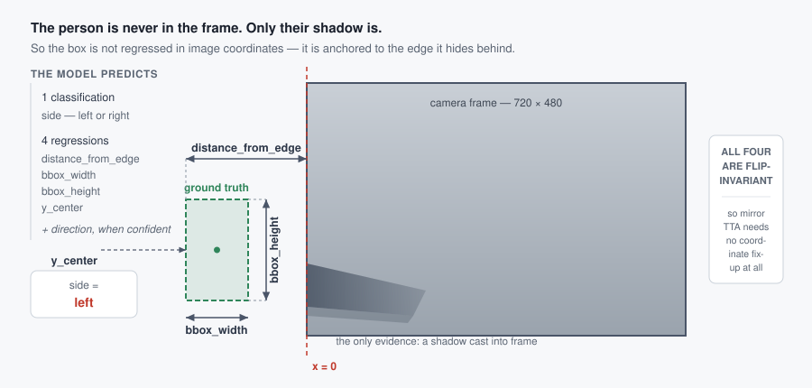
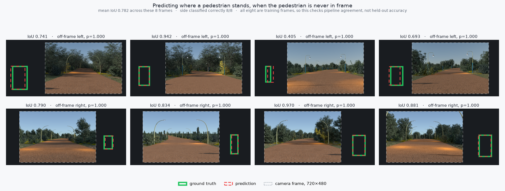

# Detection by Shadow

**Locating a pedestrian who is entirely outside the camera frame, from the
shadow they cast into it.**

[](https://github.com/alex-krasnoshtanov/Detection-by-Shadow/actions/workflows/ci.yml)
[](https://github.com/alex-krasnoshtanov/Detection-by-Shadow/actions/workflows/docker.yml)
[](https://www.python.org/downloads/)
[](LICENSE)

**Winning entry — DEMCON Deep Tech track, BrabantHack 2026**, with a
three-person team.

A vehicle-mounted camera sees a shadow stretching in from the edge of frame.
The person casting it is off-screen, possibly about to step into the road.
Predict their bounding box — in coordinates *outside the image* — and whether
they are walking into frame.



## Result

| | Test IoU | Local validation |
| --- | --- | --- |
| Predict the average box per side | — | 0.4295 mean IoU |
| Direct box regression, fully tuned, 120 epochs | not recorded | 0.4675 mean IoU |
| Decomposed targets, **3 epochs** | — | **0.5447 mean IoU** |
| Decomposed targets, native resolution | 0.614 | side accuracy **1.000** |
| **Decomposed targets, 3-seed ensemble** | **0.626** | — |

Both columns are IoU, on different sets — the left over the organisers' 414
held-out frames, the right over a slice of the training data. The 0.626 is the
team's winning score; development was collaborative, so read it as the team's
number rather than any one model's.
[`docs/experiments.md`](docs/experiments.md) records exactly what was and was
not measured, including where the record has gaps.



Above: the released weights run through this package's own prediction path.
Both boxes sit almost entirely outside the dashed camera frame, which is what
makes the task odd and the reparameterisation necessary. These eight frames are
*training* frames — they are the ones with published ground truth — so the
0.782 there measures whether this implementation agrees with the code that
produced the weights, not held-out accuracy. Reproduce it with
[`shadow-detection predict`](#or-from-the-command-line-on-the-released-weights).

## The one idea that mattered

Every annotated person is *fully* outside the frame — `xmin` runs to −0.50 of
the image width, `xmax` to +1.44. Regressing those four corners directly asks a
network for coordinates on a scale nothing in its input anchors. Fully tuned —
ResNet-50, aspect-preserving input, GIoU loss, frozen-then-unfrozen trunk,
photometric augmentation, TTA — that approach reached 0.4675 mean IoU against a
0.4295 baseline of *predicting the average box*. All that machinery bought
0.038.

The decomposed version clears that entire effort in **three epochs and 78
seconds** — 0.5447 mean IoU on the same kind of held-out split — and is still
climbing steeply when the run stops. That comparison is
[measured, not asserted](docs/experiments.md#filling-in-the-missing-comparison);
the hackathon runs never computed a local IoU for the decomposed model, so it
is new here.

So describe the box relative to the edge it hides behind instead:

| Output | | |
| --- | --- | --- |
| `side` | classification | which edge — trivial, and it saturates at 100% |
| `distance_from_edge` | regression, px | the actual difficulty |
| `bbox_width`, `bbox_height` | regression, px | |
| `y_center` | regression, px | nearly constant (σ = 14 px), so nearly free |

Same backbone, same data, same loss family. This is what moved the project from
*marginally better than the mean* to a competitive score, and it pays off three
more times: the hard 1-D problem separates cleanly from the easy 1-bit one; all
four regression targets become invariant under horizontal flip, so mirror-TTA
needs no coordinate fix-up at all; and averaging an ensemble in this space
cannot produce a box belonging to neither member.

Nineteen hand-crafted shadow descriptors — where the dark region sits, how its
mass splits left/right, which way its principal axis leans, how deep it is
relative to the surrounding road — are fused onto the pooled trunk features
through a 512-unit bottleneck, supplying the spatial layout that global average
pooling throws away.

Full write-up: [`docs/method.md`](docs/method.md).

## Quickstart

```bash
git clone https://github.com/alex-krasnoshtanov/Detection-by-Shadow
cd Detection-by-Shadow
uv sync --extra dev          # or: pip install -e ".[dev]"
pytest                       # 196 tests, no dataset or GPU needed
```

### Try it in a browser

The lowest-friction way in: no dataset, no GPU, no training.

```bash
pip install -e ".[demo]"
uvicorn shadow_detection.demo.app:app --port 8000     # then open localhost:8000
```

Or without cloning anything:

```bash
docker run --rm -p 8000:8000 -v shadow-models:/models \
  ghcr.io/alex-krasnoshtanov/detection-by-shadow:latest
```

Drop in a road frame and the predicted box is drawn on a canvas extended past
the image, because the box lies outside the picture. The model is pulled from
the release on first start and cached, so nothing large sits in git and the
second start is instant. One process serves both the API and the page -- no
Node, no build step. Details in [`docs/demo.md`](docs/demo.md).

The dataset is MIT-licensed but not vendored here — it is about 1 GB, which has
no business in a git history. See [`docs/dataset.md`](docs/dataset.md) for the
layout the loader expects. With it in place, the best result reproduces in about
40 minutes on one modern GPU:

```bash
shadow-detection train \
  --train-dir data/train_data/train_data \
  --preset ensemble \
  --output-dir runs/v5-ensemble \
  --batch-size 64 \
  --features-cache runs/features.npz

shadow-detection predict \
  --test-dir data/test_data/test_data \
  --sample-csv data/submission_example.csv \
  --checkpoints runs/v5-ensemble/model_seed*.pt \
  --output runs/submission.csv
```

### Or from the command line, on the released weights

Same weights, batch inference straight to a submission CSV.

```bash
gh release download v1.0.0 --repo filipp-lotsmanov/shadow-detection
tar -xzf model_artifacts.tar.gz          # -> model.pt, target_stats.json

shadow-detection predict \
  --test-dir path/to/frames \
  --sample-csv results/submission_example.csv \
  --checkpoints model.pt \
  --target-stats target_stats.json \
  --output submission.csv
```

`--checkpoints` accepts either form: a `state_dict` from `train`, or a
TorchScript archive like this one. That is deliberate — a deployment should not
have to install the training package to load a model, so the released artifact
carries its own graph, and
[`load_for_inference`](src/shadow_detection/model.py) sorts out which it was
handed.

No dataset to hand at all? The descriptors run on any road photograph:

```bash
shadow-detection features path/to/frame.png --mirrored
```

`train` writes a self-contained run directory — weights, `target_stats.json`
(the standardisation constants inference needs) and `run.json` (full config,
per-epoch history, wall-clock). `predict` ensembles every checkpoint it is
given and validates the submission's id order before writing it. `blend`
weighted-averages finished submissions. `export` traces a checkpoint to
TorchScript, together with the stats file it is useless without, for a
deployment that should not have to install this package.

`--batch-size 64` above because the preset's 128 was set on a 48 GB card. On
12 GB, 96 and higher spill into host memory and cost 11x; 64 holds full
throughput at 8.8 GB. Measurements in
[`docs/experiments.md`](docs/experiments.md#batch-size-is-the-one-setting-you-may-have-to-change).

## Layout

```
src/shadow_detection/
  geometry.py    the reparameterisation: decompose / reconstruct / iou
  features.py    the 19 shadow descriptors, and their mirror map
  data.py        annotation loading, target standardisation, augmentation
  model.py       ResNet-50 trunk, geometry side-channel, three heads
  train.py       both regimes: held-out validation, or all-data + fixed budget
  predict.py     flip TTA, seed ensembling, submission guard rails
  blend.py       weighted blending of finished submissions
  cli.py         shadow-detection {train,predict,blend,export,features}
  demo/          FastAPI app + static page, weights pulled from a release

Dockerfile       CPU-only image, published to GHCR by CD
docs/            method, experiment log, dataset description, demo
notebooks/       the five as-run hackathon notebooks, outputs preserved
explorations/    a classical + SAM3 pipeline, tried and dropped
results/         the submission CSVs that survive locally
tests/           196 tests, including a CPU train→predict→blend round trip
```

The notebooks are archives, not the interface — they carry the training logs
the numbers in the docs are quoted from, complete with server paths and a
preserved traceback. The package is the rewrite: the same method with the paths
as arguments, the mirror map in one place instead of three, and the
standardisation constants actually saved to disk.

## What this does not show

The results flatter the method, and it is worth saying how:

- **The frames are synthetic renders** — consistent lighting, clean shadows, no
  occlusion or clutter. Side classification hitting 100% says more about how
  legible a raytraced shadow is than about real dashcam footage.
- **1692 training images.** Enough to overfit a 25M-parameter model within
  25 epochs, and not enough to learn walking direction at all.
- **Direction was never learnable.** Two architectures, two training regimes,
  both at chance against a 48.3% base rate. The submissions abstain — the
  format accepts `-1`, and a coin flip is worse than declining.
- **The feature block was never ablated.** `ShadowNet(num_features=0)` builds
  the image-only comparison and is tested, but no run measured it. The v2→v4
  jump changed three things at once.
- **The best score is the best score that can be evidenced.** A blend across
  the team's models was attempted in the final hour; that notebook cell failed
  and no result was recorded. 0.626 is what stands.
- **The figure is not a held-out evaluation.** Those eight frames are training
  frames, and the released model trained on all of them. It shows the pipeline
  agrees end to end; it does not measure generalisation.
- **Feature thresholds were chosen by eye** and never swept.

[`docs/method.md#known-issues`](docs/method.md#known-issues) has the rest,
including one genuine bug — the principal-axis angle is not negated when
mirrored — kept because the published scores were produced with it, and pinned
by a test so it cannot be fixed silently.

## Credits

A three-person team — [Filipp Lotsmanov](https://github.com/filipp-lotsmanov),
Oleksii Krasnoshtanov and Danil Sysenko.

Collaborative in the way hackathons are: notebooks passed between us, and
whoever's run scored best became everyone's starting point. The decomposed
target formulation, the 19 geometric descriptors and the flip-aware
augmentation all came out of that loop rather than from any one of us, and
**0.626 was the team's result, not a solo one.**

What this repository adds on top of the shared work: the exploratory analysis
and the v1/v2 direct-regression line that diagnosed the target-space problem,
the full-resolution and all-data ensemble runs, and this rewrite into a tested
package.

Filipp has published the deployable half — a FastAPI + Next.js demo and the
trained weights:
**[filipp-lotsmanov/shadow-detection](https://github.com/filipp-lotsmanov/shadow-detection)**.
The figure above and the quickstart below both run on that release.

Original hackathon repository (university account, full commit history):
[OleksiiKrasnoshtanov240247/Hackaton](https://github.com/OleksiiKrasnoshtanov240247/Hackaton).
Filipp's parallel exploratory notebook lives there and is not reproduced here.

## Licence

[MIT](LICENSE), matching the original repository. The challenge dataset is not
covered by it and is not included.
